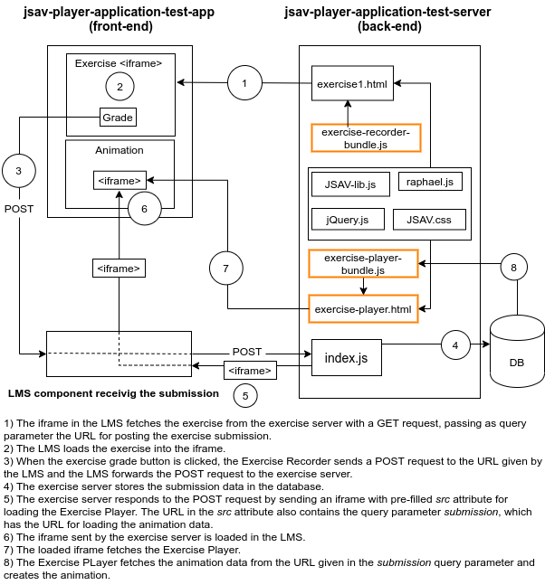

# jsav-player-application
This repository contains two submodules with the components to record and replay JSAV Visual Algorithm Simulation (VAS) exercises, and two submodules to set up a test application.

The submodules for recording and replaying the JSAV VAS exercises are:
- [jsav-exercise-recorder](https://github.com/MarianiGiacomo/jsav-exercise-recorder)
- [jsav-exercise-player](https://github.com/MarianiGiacomo/jsav-exercise-player)

The submodules for the test application are:
- [jsav-player-application-test-app](https://github.com/MarianiGiacomo/jsav-player-application-test-app) (front-end)
- [jsav-plauer-application-test-server](https://github.com/MarianiGiacomo/jsav-plauer-application-test-server) (back-end)

If you want to get all the submodules you can clone this repository with:
`git clone --recurse-submodules https://github.com/MarianiGiacomo/jsav-player-application.git`

The picture below shows how the Exercise Recorder (exercise-recorder-bundle.js) and the Exercise Player (exercise-player-bundle.js & exercise-player.html) are integrated in the test application.

